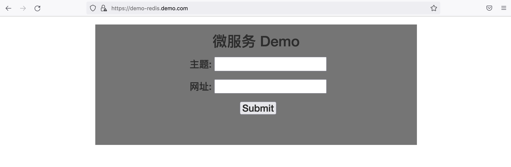

#  应用迁移到OCI OKE 平台演示

## 1.1 OKE 应用迁移架构


**应用部署流程**：如图中棕色数字标识</br>
**应用访问流程**：如图中黑色数字标识</br>

## 1.2 简介

以Golang开发的微服务应用如何迁移部署到OCI OKE平台演示：包含前端应用程序、MySQL和Redis集群。其中前端应用程序的容器镜像事先已经配置好，存放在OCI容器注册表中。


### 1.2.1 先决条件

- 成功部署kubernetes集群
- 配置好集群访问

## 1.3 Task 1: 创建OKE Ingress控制器

每个在kubernetes集群部署的服务，如果要允许外部访问，缺省会创建一个Load Balancer。这样会浪费Load Balancer的资源。我们可以用Ingress来统一外部的访问。Ingress是一组规则，允许入站连接到达集群服务。 它位于多个服务的前面，充当智能路由器。


1. 运行下列命令在kubernetes集群里部署ingress控制器。注意，在本实验中，我们使用的是ingress控制器1.5.1版本。建议使用最新的版本，最新版本号可以[在该网页中查到](https://github.com/kubernetes/ingress-nginx)。

    ```
    $ <copy>kubectl apply -f https://raw.githubusercontent.com/kubernetes/ingress-nginx/controller-v1.5.1/deploy/static/provider/cloud/deploy.yaml</copy>
    namespace/ingress-nginx created
    serviceaccount/ingress-nginx created
    configmap/ingress-nginx-controller created
    clusterrole.rbac.authorization.k8s.io/ingress-nginx created
    clusterrolebinding.rbac.authorization.k8s.io/ingress-nginx created
    role.rbac.authorization.k8s.io/ingress-nginx created
    rolebinding.rbac.authorization.k8s.io/ingress-nginx created
    service/ingress-nginx-controller-admission created
    service/ingress-nginx-controller created
    deployment.apps/ingress-nginx-controller created
    validatingwebhookconfiguration.admissionregistration.k8s.io/ingress-nginx-admission created
    serviceaccount/ingress-nginx-admission created
    clusterrole.rbac.authorization.k8s.io/ingress-nginx-admission created
    clusterrolebinding.rbac.authorization.k8s.io/ingress-nginx-admission created
    role.rbac.authorization.k8s.io/ingress-nginx-admission created
    rolebinding.rbac.authorization.k8s.io/ingress-nginx-admission created
    job.batch/ingress-nginx-admission-create created
    job.batch/ingress-nginx-admission-patch created
    ```

    

2. 检查ingress控制器服务状态。记录下ingress控制器的External-IP。

    ```
    $ <copy>kubectl get svc -n ingress-nginx</copy>
    NAME                                 TYPE           CLUSTER-IP      EXTERNAL-IP      PORT(S)                      AGE
    ingress-nginx-controller             LoadBalancer   10.96.208.136   146.56.161.249   80:31276/TCP,443:31632/TCP   13m
    ingress-nginx-controller-admission   ClusterIP      10.96.10.134    <none>           443/TCP                      13m
    
    ```

    

3. 我们也可以从OCI控制台中查看到新创建了一个Load Balancer，在Load Balancer里有两个监听程序，分别监听80 和 443 端口。

    

4. 如果采用SSL访问，需要配置证书。我们可以运行下列命令来创建自签名的证书和密钥。

    ```
    $ <copy>openssl req -x509 -nodes -days 365 -newkey rsa:2048 -keyout tls.key -out tls.crt -subj "/CN=nginxsvc/O=nginxsvc"</copy>
    Generating a 2048 bit RSA private key
    ...............+++
    ....................................................+++
    writing new private key to 'tls.key'
    -----
    ```

    

5. 用证书和密钥文件创建TLS secret。TLS secret是用于ingress控制器上的SSL终止的，客户端可以通过SSL进行访问。

    ```
    $ <copy>kubectl create secret tls tls-secret --key tls.key --cert tls.crt</copy>
    secret/tls-secret created
    ```

    


## Task 2: 安装部署工具Helm

Helm 是一个用于 Kubernetes 应用的包管理工具，主要用来管理Helm Charts。有点类似于Linux中的 YUM。Helm Chart 是用来封装 Kubernetes 原生应用程序的一系列 YAML 文件。可以在你部署应用的时候自定义应用程序的一些 Metadata，以便于应用程序的分发。对于应用发布者而言，可以通过 Helm 打包应用、管理应用依赖关系、管理应用版本并发布应用到软件仓库。对于使用者而言，使用 Helm 后不用需要编写复杂的应用部署文件，可以以简单的方式在 Kubernetes 上查找、安装、升级、回滚、卸载应用程序。

1. 下载helm安装包

    ```
    $ <copy>wget https://get.helm.sh/helm-v3.7.1-linux-386.tar.gz</copy>
    --2022-01-07 03:45:52--  https://get.helm.sh/helm-v3.7.1-linux-386.tar.gz
    Resolving get.helm.sh (get.helm.sh)... 152.199.39.108, 2606:2800:247:1cb7:261b:1f9c:2074:3c
    Connecting to get.helm.sh (get.helm.sh)|152.199.39.108|:443... connected.
    HTTP request sent, awaiting response... 200 OK
    Length: 12750265 (12M) [application/x-tar]
    Saving to: 'helm-v3.7.1-linux-386.tar.gz'
    
    100%[===================================================================>] 12,750,265  28.5MB/s   in 0.4s   
    
    2022-01-07 03:45:53 (28.5 MB/s) - 'helm-v3.7.1-linux-386.tar.gz' saved [12750265/12750265]
    
    ```

    

2. 解压。

    ```
    $ <copy>tar -zxvf helm-v3.7.1-linux-386.tar.gz</copy>
    linux-386/
    linux-386/helm
    linux-386/LICENSE
    linux-386/README.md
    ```

    

3. 安装。

    ```
    $ <copy>sudo chmod +x linux-386/helm</copy> 
    $ <copy>sudo mv linux-386/helm /usr/local/bin/</copy>
    <copy> 
    </copy>
    ```

    

4. 验证。

    ```
    $ <copy>helm version</copy>
    WARNING: Kubernetes configuration file is group-readable. This is insecure. Location: /home/opc/.kube/config
    WARNING: Kubernetes configuration file is world-readable. This is insecure. Location: /home/opc/.kube/config
    version.BuildInfo{Version:"v3.7.1", GitCommit:"1d11fcb5d3f3bf00dbe6fe31b8412839a96b3dc4", GitTreeState:"clean", GoVersion:"go1.16.9"}
    ```

    


## Task 3: 部署Redis集群

下面我们将使用helm来部署Redis集群。

1. 添加helm资料库。Bitnami是一个常用的资料库，提供各种应用程序和解决方案堆栈安装包下载。

    ```
    $ <copy>helm repo add bitnami https://charts.bitnami.com/bitnami</copy>
    WARNING: Kubernetes configuration file is group-readable. This is insecure. Location: /home/opc/.kube/config
    WARNING: Kubernetes configuration file is world-readable. This is insecure. Location: /home/opc/.kube/config
    "bitnami" has been added to your repositories
    ```

    

2. 新建一个命名空间，名称为redis。

    ```
    $ <copy>kubectl create ns redis</copy>
    namespace/redis created
    ```

    

3. 部署Redis集群(**注意：**请不要更改密码，应用程序打包时固定了)。

    ```
    $ <copy>helm install redis bitnami/redis -n redis --set auth.password=I3gQqFlxxU</copy>
    WARNING: Kubernetes configuration file is group-readable. This is insecure. Location: /home/opc/.kube/config
    WARNING: Kubernetes configuration file is world-readable. This is insecure. Location: /home/opc/.kube/config
    NAME: redis
    LAST DEPLOYED: Fri Jan  7 04:05:54 2022
    NAMESPACE: redis
    STATUS: deployed
    REVISION: 1
    TEST SUITE: None
    NOTES:
    CHART NAME: redis
    CHART VERSION: 15.7.1
    APP VERSION: 6.2.6
    
    ** Please be patient while the chart is being deployed **
    
    Redis&trade; can be accessed on the following DNS names from within your cluster:
    
        redis-master.redis.svc.cluster.local for read/write operations (port 6379)
        redis-replicas.redis.svc.cluster.local for read-only operations (port 6379)
    
    
    
    To get your password run:
    
        export REDIS_PASSWORD=$(kubectl get secret --namespace redis redis -o jsonpath="{.data.redis-password}" | base64 --decode)
    
    To connect to your Redis&trade; server:
    
    1. Run a Redis&trade; pod that you can use as a client:
    
       kubectl run --namespace redis redis-client --restart='Never'  --env REDIS_PASSWORD=$REDIS_PASSWORD  --image docker.io/bitnami/redis:6.2.6-debian-10-r90 --command -- sleep infinity
    
       Use the following command to attach to the pod:
    
       kubectl exec --tty -i redis-client \
       --namespace redis -- bash
    
    2. Connect using the Redis&trade; CLI:
       REDISCLI_AUTH="$REDIS_PASSWORD" redis-cli -h redis-master
       REDISCLI_AUTH="$REDIS_PASSWORD" redis-cli -h redis-replicas
    
    To connect to your database from outside the cluster execute the following commands:
    
        kubectl port-forward --namespace redis svc/redis-master 6379:6379 &
        REDISCLI_AUTH="$REDIS_PASSWORD" redis-cli -h 127.0.0.1 -p 6379
        
    ```

    

4. 检查pod状态，缺省会创建一主三从的Redis集群。如果状态还没准备好，可以稍等几分钟后再检查。直到全部Ready状态。

    ```
    $ <copy>kubectl get pod -n redis</copy>
    NAME               READY   STATUS              RESTARTS   AGE
    redis-master-0     1/1     Running             0          3m27s
    redis-replicas-0   1/1     Running             0          3m27s
    redis-replicas-1   1/1     Running             0          105s
    redis-replicas-2   0/1     ContainerCreating   0          15s
    
    $ kubectl get pod -n redis
    NAME               READY   STATUS    RESTARTS   AGE
    redis-master-0     1/1     Running   0          4m57s
    redis-replicas-0   1/1     Running   0          4m57s
    redis-replicas-1   1/1     Running   0          3m15s
    redis-replicas-2   1/1     Running   0          105s
    ```

    

5. 检查服务状态

    ```
    $ <copy>kubectl get svc -n redis</copy>
    NAME             TYPE        CLUSTER-IP      EXTERNAL-IP   PORT(S)    AGE
    redis-headless   ClusterIP   None            <none>        6379/TCP   8m22s
    redis-master     ClusterIP   10.96.200.226   <none>        6379/TCP   8m22s
    redis-replicas   ClusterIP   10.96.125.190   <none>        6379/TCP   8m22s
    ```

    

6. 你可以执行下面的命令来获取Redis密码。

    ```
    $ <copy>export REDIS_PASSWORD=$(kubectl get secret --namespace redis redis -o jsonpath="{.data.redis-password}" | base64 --decode)</copy>
    $ <copy>echo $REDIS_PASSWORD</copy>
    I3gQqFlxxU
    ```

    

7. 连接到redis master节点所在pod。

    ```
    $ <copy>kubectl -n redis exec -it redis-master-0 -- bash</copy>
    1001@redis-master-0:/$ 
    ```

    

8. 连接到redis，使用之前设置好的redis密码。

    ```
    1001@redis-master-0:/$ <copy>redis-cli -h redis-master -a 'I3gQqFlxxU'</copy>
    Warning: Using a password with '-a' or '-u' option on the command line interface may not be safe.
    redis-master:6379>
    ```

    

9. 在Redis中设置一个key-value，并查询出来。

    ```
    redis-master:6379> <copy>set myname testvalue</copy>
    OK
    redis-master:6379> <copy>get myname</copy>
    "testvalue"
    redis-master:6379>
    ```

    

10. 退出Redis，并退出相应pod。

    ```
    redis-master:6379> <copy>exit</copy>
    1001@redis-master-0:/$ <copy>exit</copy>
    exit
    $
    ```

    

## Task 4: 在kubernetes集群中部署MySQL

1. 获取事先写好的MySQL配置文件：mysql-statusfull.yaml。

    ```
    $ <copy>wget https://raw.githubusercontent.com/minqiaowang/oci-k8s-cn/main/deploy-complex-app/mysql-statusfull.yaml</copy>
    --2022-01-07 07:18:02--  https://raw.githubusercontent.com/minqiaowang/oci-k8s-cn/main/deploy-complex-app/mysql-statusfull.yaml
    Resolving raw.githubusercontent.com (raw.githubusercontent.com)... 185.199.111.133, 185.199.108.133, 185.199.109.133, ...
    Connecting to raw.githubusercontent.com (raw.githubusercontent.com)|185.199.111.133|:443... connected.
    HTTP request sent, awaiting response... 200 OK
    Length: 1639 (1.6K) [text/plain]
    Saving to: 'mysql-statusfull.yaml'
    
    100%[===================================================================>] 1,639       --.-K/s   in 0s      
    
    2022-01-07 07:18:02 (20.6 MB/s) - 'mysql-statusfull.yaml' saved [1639/1639]
    
    ```

    

2. 查看该文件内容，该文件定义部署一个单节点的MySQL到kubernetes集群中，命名空间也是redis。MySQL的password也在该文件中设置。

    ```
    $ <copy>cat mysql-statusfull.yaml</copy> 
    ---
    apiVersion: v1
    kind: ConfigMap
    metadata:
      name: mysql
      labels:
        app: mysql
      namespace: redis
    data:
      master.cnf: |
        # Apply this config only on the master.
        [mysqld]
        log-bin
    
    ---
    apiVersion: apps/v1
    kind: StatefulSet
    metadata:
      name: mysql
      namespace: redis
    spec:
      selector:
        matchLabels:
          app: mysql
      serviceName: mysql
      replicas: 1
      template:
        metadata:
          labels:
            app: mysql
        spec:
          containers:
          - name: mysql                   
            image: mysql
            env:
            - name: MYSQL_ROOT_PASSWORD
              value: "Ora@2021.passwd"
            ports:
            - name: mysql
              containerPort: 3306
            volumeMounts:
            - name: data
              mountPath: /var/lib/mysql
              subPath: mysql
            - name: conf
              mountPath: /etc/mysql/conf.d
            resources:
              requests:
                cpu: 500m
                memory: 1Gi
            volumeMounts:
            - name: data
              mountPath: /var/lib/mysql
              subPath: mysql
            - name: conf
              mountPath: /etc/mysql/conf.d
            resources:
              requests:
                cpu: 100m
                memory: 100Mi
          volumes:
          - name: conf
            emptyDir: {}
          - name: config-map
            configMap:
              name: mysql
      volumeClaimTemplates:
      - metadata:
          name: data
        spec:
          accessModes: ["ReadWriteOnce"]
          resources:
            requests:
              storage: 10Gi
    ---
    apiVersion: v1
    kind: Service
    metadata:
      name: mysql
      labels:
        app: mysql
      namespace: redis
    spec:
      ports:
      - name: mysql
        port: 3306
      clusterIP: None
      selector:
        app: mysql
    ```

    

3. 运行下列命令来部署MySQL。

    ```
    $ <copy>kubectl apply -f mysql-statusfull.yaml</copy>
    configmap/mysql created
    statefulset.apps/mysql created
    service/mysql created
    ```

    

4. 检查MySQL状态，可以看到有mysql的服务运行在mysql-0的pod中。

    ```
    $ <copy>kubectl -n redis get pod,svc</copy>
    NAME                   READY   STATUS    RESTARTS   AGE
    pod/mysql-0            1/1     Running   0          2m54s
    pod/redis-master-0     1/1     Running   0          3h20m
    pod/redis-replicas-0   1/1     Running   0          3h20m
    pod/redis-replicas-1   1/1     Running   0          3h18m
    pod/redis-replicas-2   1/1     Running   0          3h17m
    
    NAME                     TYPE        CLUSTER-IP      EXTERNAL-IP   PORT(S)    AGE
    service/mysql            ClusterIP   None            <none>        3306/TCP   2m54s
    service/redis-headless   ClusterIP   None            <none>        6379/TCP   3h20m
    service/redis-master     ClusterIP   10.96.200.226   <none>        6379/TCP   3h20m
    service/redis-replicas   ClusterIP   10.96.125.190   <none>        6379/TCP   3h20m
    ```

    

5. 下载事先写好的SQL脚本文件，该脚本用来创建MySQL的demo表。

    ```
    $ wget https://raw.githubusercontent.com/minqiaowang/oci-k8s-cn/main/deploy-complex-app/microdb.sql
    --2022-01-07 07:32:32--  https://raw.githubusercontent.com/minqiaowang/oci-k8s-cn/main/deploy-complex-app/microdb.sql
    Resolving raw.githubusercontent.com (raw.githubusercontent.com)... 185.199.108.133, 185.199.109.133, 185.199.110.133, ...
    Connecting to raw.githubusercontent.com (raw.githubusercontent.com)|185.199.108.133|:443... connected.
    HTTP request sent, awaiting response... 200 OK
    Length: 5060 (4.9K) [text/plain]
    Saving to: 'microdb.sql'
    
    100%[===================================================================>] 5,060       --.-K/s   in 0s      
    
    2022-01-07 07:32:33 (37.4 MB/s) - 'microdb.sql' saved [5060/5060]
    ```

    

6. 将SQL脚本文件拷贝到MySQL所在的pod中。

    ```
    $ <copy>kubectl -n redis cp ./microdb.sql mysql-0:/microdb.sql</copy>
    ```

    

7. 连接到MySQL所在的pod。

    ```
    [opc@docker-test ~]$ <copy>kubectl -n redis exec -it mysql-0 -- bash</copy>
    root@mysql-0:/# 
    ```

    

8. 连接到MySQL数据库。

    ```
    root@mysql-0:/# <copy>mysql -uroot -p'Ora@2021.passwd'</copy>
    mysql: [Warning] Using a password on the command line interface can be insecure.
    Welcome to the MySQL monitor.  Commands end with ; or \g.
    Your MySQL connection id is 9
    Server version: 8.0.27 MySQL Community Server - GPL
    
    Copyright (c) 2000, 2021, Oracle and/or its affiliates.
    
    Oracle is a registered trademark of Oracle Corporation and/or its
    affiliates. Other names may be trademarks of their respective
    owners.
    
    Type 'help;' or '\h' for help. Type '\c' to clear the current input statement.
    
    mysql> 
    ```

    

9. 创建Demo数据库和demo用户并授于相应的权限。

    ```
    mysql> <copy>create database microdb;</copy>
    Query OK, 1 row affected (0.01 sec)
    
    mysql> <copy>CREATE USER 'micro'@'%' IDENTIFIED BY 'Ora@2021.passwd';</copy>
    Query OK, 0 rows affected (0.01 sec)
    
    mysql> <copy>alter user 'micro'@'%' identified with mysql_native_password by 'Ora@2021.passwd';</copy>
    Query OK, 0 rows affected (0.00 sec)
    
    mysql> <copy>GRANT ALL PRIVILEGES ON microdb.* TO 'micro'@'%' ;</copy>
    Query OK, 0 rows affected (0.01 sec)
    
    mysql> <copy>FLUSH PRIVILEGES;</copy>
    Query OK, 0 rows affected (0.00 sec)
    
    mysql> 
    ```

    

10. 进入microdb数据库，执行建表脚本。

    ```
    mysql> <copy>use microdb;</copy>
    Database changed
    mysql> <copy>source microdb.sql;</copy>
    Query OK, 0 rows affected (0.00 sec)
    
    Query OK, 0 rows affected (0.00 sec)
    
    Query OK, 0 rows affected (0.00 sec)
    
    Query OK, 0 rows affected (0.00 sec)
    
    Query OK, 0 rows affected (0.00 sec)
    
    Query OK, 0 rows affected (0.01 sec)
    
    Query OK, 1 row affected, 1 warning (0.00 sec)
    
    Database changed
    Query OK, 0 rows affected (0.01 sec)
    
    Query OK, 0 rows affected (0.00 sec)
    
    Query OK, 0 rows affected (0.00 sec)
    
    Query OK, 0 rows affected (0.03 sec)
    
    ...
    ...
    
    Query OK, 0 rows affected (0.00 sec)
    
    Query OK, 0 rows affected (0.00 sec)
    
    Query OK, 0 rows affected (0.00 sec)
    
    mysql> 
    ```

    

11. 查看创建的demo表。

    ```
    mysql> <copy>show tables;</copy>
    +-------------------+
    | Tables_in_microdb |
    +-------------------+
    | article           |
    | users             |
    +-------------------+
    2 rows in set (0.00 sec)
    
    mysql> 
    ```

    

12. 退出MySQL，并退出pod连接。

    ```
    mysql> <copy>exit</copy>
    Bye
    root@mysql-0:/# <copy>exit</copy>
    exit
    $
    ```

    


## Task 5: 在OKE中部署微服务应用

以上Demo应用容器镜像已经事先创建好，并保存在共享的OCI的容器注册表中。要获取该容器镜像，我们需要创建一个相应的secret。

1. 运行下列命令，创建一个secret，名称为ocirsecret-sh。

    ```
    $ <copy>kubectl -n redis create secret docker-registry ocirsecret-sh --docker-server=icn.ocir.io  --docker-username='oraclepartnersas/mquser' --docker-password='m<b3ttu:cPqvUa8K<6rN'  --docker-email='yourmail@oracle.com'</copy>
    secret/ocirsecret-sh created
    ```

    

2. 获取应用部署文件：micro-redis.yaml。

    ```
    $ <copy>wget https://raw.githubusercontent.com/minqiaowang/oci-k8s-cn/main/deploy-complex-app/micro-redis.yaml</copy>
    --2022-01-07 08:21:10--  https://raw.githubusercontent.com/minqiaowang/oci-k8s-cn/main/deploy-complex-app/micro-redis.yaml
    Resolving raw.githubusercontent.com (raw.githubusercontent.com)... 185.199.108.133, 185.199.110.133, 185.199.109.133, ...
    Connecting to raw.githubusercontent.com (raw.githubusercontent.com)|185.199.108.133|:443... connected.
    HTTP request sent, awaiting response... 200 OK
    Length: 1187 (1.2K) [text/plain]
    Saving to: 'micro-redis.yaml'
    
    100%[===================================================================>] 1,187       --.-K/s   in 0s      
    
    2022-01-07 08:21:10 (71.5 MB/s) - 'micro-redis.yaml' saved [1187/1187]
    ```

    

3. 查看该文件。可以看到`imagePullSecrets name`为之前创建的OCIR secret，用来获取存储的容器镜像。`tls secretName`为在Task 1中创建的TLS Secret，这样我们就可以通过https来访问应用。另外，我们配置了ingress控制器来分配应用访问负载，不需要再配置新的Load Balancer。

    ```
    $ <copy>cat micro-redis.yaml</copy> 
    apiVersion: apps/v1
    kind: Deployment
    metadata:
      name: demo-redis-dp
      namespace: redis
    spec:
      selector:
        matchLabels:
          app: demo-redis-dp
      replicas: 3
      template:
        metadata:
          labels:
            app: demo-redis-dp
        spec:
          containers:
          - name: demo-redis
            image: icn.ocir.io/oraclepartnersas/baineng-oke-registry:demo-redis.v5
            imagePullPolicy: Always
            ports:
            - name: demo-redis
              containerPort: 8000
              protocol: TCP
          imagePullSecrets:
            - name: ocirsecret
    ---
    apiVersion: v1
    kind: Service
    metadata:
      name: demo-redis-svc
      labels:
        app: demo-redis-svc
      namespace: redis
    spec:
      type: ClusterIP
      ports:
      - port: 8000
        protocol: TCP
        targetPort: 8000
      selector:
        app: demo-redis-dp
        
    ---
    apiVersion: networking.k8s.io/v1
    kind: Ingress
    metadata:
      annotations:
        kubernetes.io/ingress.class: "nginx"
      labels:
        app.kubernetes.io/instance: demo-redis-dp
      name: demo-redis-ingress
      namespace: redis
    spec:
      tls:
      - secretName: tls-secret
      rules:
      - host: demo-redis.demo.com
        http:
          paths:
            - path: /
              pathType: Prefix
              backend:
                service:
                    name: demo-redis-svc
                    port:
                      number: 8000
    ```
    
    
    
4. 部署前端应用

    ```bash
      $ <copy>kubectl apply -f micro-redis.yaml -n redis</copy>
      deployment.apps/demo-redis-dp created
      service/demo-redis-svc created
      Warning: networking.k8s.io/v1beta1 Ingress is deprecated in v1.19+, unavailable in v1.22+; use networking.k8s.io/v1 Ingress
      ingress.networking.k8s.io/demo-redis-ingress created
    ```

    

5. 检查pod状态，其中`demo-redis-dp-*`为3个应用部署的pod。

```
  $ <copy>kubectl get pod -n redis</copy>
  NAME                             READY   STATUS    RESTARTS   AGE
  demo-redis-dp-5fd4585bdd-5fqbc   1/1     Running   0          83s
  demo-redis-dp-5fd4585bdd-hmjvr   1/1     Running   0          83s
  demo-redis-dp-5fd4585bdd-z4ntg   1/1     Running   0          83s
  mysql-0                          1/1     Running   0          68m
  redis-master-0                   1/1     Running   0          4h25m
  redis-replicas-0                 1/1     Running   0          4h25m
  redis-replicas-1                 1/1     Running   0          4h24m
  redis-replicas-2                 1/1     Running   0          4h22m
  ```

    

6. 检查svc服务状态，并记录demo-redis-ingress的HOSTS对应的IP地址。

    ```
    $ <copy>kubectl -n redis get ingress</copy>
    NAME                 CLASS    HOSTS                 ADDRESS          PORTS   AGE
    demo-redis-ingress   <none>   demo-redis.demo.com   146.56.161.249   80      4m7s
    ```

    

7. 因为ingress控制器需要通过域名来分发连接后端的服务，而不是通过IP地址，所以我们需要添加加域名解析。Mac系统编辑文件：`sudo vi /etc/hosts`, Windows系统编辑：`“windows”→“System32”→“drivers”→“etc” →“hosts”` 文件。在hosts文件中增加以下条目，请使用自己查出的IP地址和HOST名。

    ```
    146.56.161.249 demo-redis.demo.com
    ```

    

8. 打开浏览器，访问地址`https://demo-redis.demo.com`，显示如下界面。

    

9. 输入数据。

    - 主题：输入任何主题，如：topic1

    - 网址：输入任何网址，如：`https://www.test1.com`

    - 点击Submit。数据成功保存到MySQL表中

        

10. 要查询提交的记录，可以输入下列网址：`https://demo-redis.demo.com/article/list`，查询相应记录的articleId。如：刚才输入的记录的articleId为38。

    

11. 按照上面的articleId查询记录，输入URL：`https://demo-redis.demo.com/article/getone/38`。注意当前返回的数据源为mysql。

    

12. 刷新网址，可以发现第二次查询返回的数据源为Redis。

    

13. 缺省设置为5分钟之后，缓存将会从redis中清除，再次查询数据来源又会是MySQL.

    

14. 实验完成后，删除部署的应用。

    ```
    $ <copy>kubectl delete -f micro-redis.yaml -n redis</copy>
    deployment.apps "demo-redis-dp" deleted
    service "demo-redis-svc" deleted
    Warning: networking.k8s.io/v1beta1 Ingress is deprecated in v1.19+, unavailable in v1.22+; use networking.k8s.io/v1 Ingress
    ingress.networking.k8s.io "demo-redis-ingress" deleted
    ```

    

15. 删除部署的MySQL

    ```
    $ <copy>kubectl delete -f mysql-statusfull.yaml</copy>
    configmap "mysql" deleted
    statefulset.apps "mysql" deleted
    service "mysql" deleted
    ```

    

16. 删除部署的Redis集群

    ```
    $ <copy>helm uninstall redis -n redis</copy>
    WARNING: Kubernetes configuration file is group-readable. This is insecure. Location: /home/opc/.kube/config
    WARNING: Kubernetes configuration file is world-readable. This is insecure. Location: /home/opc/.kube/config
    release "redis" uninstalled
    ```

    

17. 查看是否当前pod为空。

    ```
    $ <copy>kubectl get pod -n redis</copy>
    No resources found in redis namespace.
    ```

    

18. 删除ingress控制器。

    ```
    $ <copy>kubectl delete -f https://raw.githubusercontent.com/kubernetes/ingress-nginx/controller-v0.44.0/deploy/static/provider/cloud/deploy.yaml</copy>
    namespace "ingress-nginx" deleted
    serviceaccount "ingress-nginx" deleted
    configmap "ingress-nginx-controller" deleted
    clusterrole.rbac.authorization.k8s.io "ingress-nginx" deleted
    clusterrolebinding.rbac.authorization.k8s.io "ingress-nginx" deleted
    role.rbac.authorization.k8s.io "ingress-nginx" deleted
    rolebinding.rbac.authorization.k8s.io "ingress-nginx" deleted
    service "ingress-nginx-controller-admission" deleted
    service "ingress-nginx-controller" deleted
    deployment.apps "ingress-nginx-controller" deleted
    validatingwebhookconfiguration.admissionregistration.k8s.io "ingress-nginx-admission" deleted
    serviceaccount "ingress-nginx-admission" deleted
    clusterrole.rbac.authorization.k8s.io "ingress-nginx-admission" deleted
    clusterrolebinding.rbac.authorization.k8s.io "ingress-nginx-admission" deleted
    role.rbac.authorization.k8s.io "ingress-nginx-admission" deleted
    rolebinding.rbac.authorization.k8s.io "ingress-nginx-admission" deleted
    job.batch "ingress-nginx-admission-create" deleted
    job.batch "ingress-nginx-admission-patch" deleted
    ```

## Task 6: 应用部署场景考虑问题思考

  前面Demo演示一个微服务应用部署过程，很多技术细节已经屏蔽，但应用部署场景，还需考虑下面问题，下面从客户重点关注角度改造上面微服务应用。

### <font color="red"> 常见问题 1: 配置文件提取与敏感信息加密处理 </font>

  OKE完全兼容原生Kubernetes,同样可以采取Configmap 和 Secret方式解决。

  **-Configmap**：适用于应用程序公共配置信息存储，可以将配置信息和Docker镜像解耦，友好的进行配置共享。

  **-Secret**：使用敏感信息存储。包括三种类型加密:

    *Opaque：使用base64编码存储信息，可以通过Base64 --decode解码获得原始数据。</br>
    *Dockerconfigjson：用于存储Docker Registry的认证信息。</br>
    *service-account-token：用于被 serviceaccount 引用，serviceaccout 创建时 Kubernetes 会默认创建对应的 Secret。</br>

1.  应用配置文件提取-Configmap 
    
   <font color="red">  Task 1:</font> 编辑应用配置文件 config.yaml

    ```text
    <copy>
    database:
      dbtype: mysql
      username: micro
      password: MYSQL_PASSWORD
      host: mysql.redis:3306
      dbname: microdb
      charset: utf8
      parsetime: True
      maxidleconns: 10
      maxopenconns: 30
    server:
      runmode: debug
      httpport: 8000
      readtimeout: 60
      writetimeout: 60
    redis:
      addr: redis-master.redis:6379
      password: REDIS_PASSWORD
    </copy>
    ```

  <font color="red"> Task 2:</font> 创建 configmap

    ```bash
    $ <copy> kubectl create configmap demo-config --from-file=config.yaml -n redis </copy>
    ```

2. 敏感信息加密

  <font color="red"> Task 1:</font> 加密 MySQL Password 敏感信息

    ```bash
      $ <copy> echo -n 'Ora@2021.passwd' | base64 </copy>
      T3JhQDIwMjEucGFzc3dk
    ```

  <font color="red">   Task 2:</font> 加密 Redis Password 敏感信息

    ```bash
      $ <copy> echo -n 'I3gQqFlxxU' | base64 </copy>
    STNnUXFGbHh4VQ==
    ```

  Task 3: 复制加密信息到 app-secret.yaml 对应段落的 password 的值：

    ```text
    <copy>
      ---
      apiVersion: v1
      kind: Secret
      metadata:
        name: mysql-secret
        namespace: redis
      type: Opaque
      data:
        password: T3JhQDIwMjEucGFzc3dk

      ---
      apiVersion: v1
      kind: Secret
      metadata:
        name: redis-secret
        namespace: redis
      type: Opaque
      data:
        password: STNnUXFGbHh4VQ==
    </copy>

   ```

  Task 4: 创建 Secret 

    ```
    $ <copy> kubectl apply -f app-secret.yaml </copy> 
    ```


3. 调整应用部署 Manifest 文件 micro-app-with-ingress.yml

  Task 1: 下载应用部署 Manifest 文件 micro-app-with-ingress.yml

    ```bash
    $ <copy> curl -o micro-app-with-ingress.yml https://raw.githubusercontent.com/nengbai/oke-dashboard/main/deploy-complex-app/micro-app-with-ingress.yml </copy>
    ```

  Task 2: 编辑 micro-app-with-ingress.yml，参照下面信息，增加从env: 开始章节内容。

    ```text
    <copy>
    apiVersion: apps/v1
    kind: Deployment
    metadata:
    name: demo-app-dp
    namespace: redis
    spec:
      selector:
        matchLabels:
          app: demo-app-dp
      replicas: 3
      template:
        metadata:
          labels:
            app: demo-app-dp
        spec:
          containers:
          - name: demo-redis
            image: icn.ocir.io/oraclepartnersas/baineng-oke-registry:demo-app.v6
            imagePullPolicy: Always
            ports:
            - name: demo-port
              containerPort: 8000
              protocol: TCP
              #command: ["/bin/sh", "-c", "env"]
              env:
                - name: DATABASE_PASSWORD  # 传入pod中的变量名
                  #设置 secret mysql用户的密码
                  valueFrom:
                    secretKeyRef:
                      name: mysql-secret    # secret 中的 name
                      key: password          # configmap 中的 key
                - name: REDIS_PASSWORD     # 传入pod中的变量名
                  #设置 secret redis用户的密码
                  valueFrom:
                    secretKeyRef:
                      name: redis-secret    # secret 中的 name 
                      key: password          # configmap 中的 key
              volumeMounts:
                - name: config
                  mountPath: /app/config/config.yaml
                  subPath: config.yaml
                  readOnly: true
          volumes:
          - name: config
                configMap:
                  name: demo-config # 指定我们创建的configMap的名字    
      </copy>
      ```
  
    Task 3: 部署重新应用

      ```
      $ <copy> kubectl apply -f micro-app-with-ingress.yml </copy>
      ```
  
    Task 4: 检查应用运行状态

      ```
      $ <copy> kubectl -n redis get pod </copy>
      ```
  
    Task 5: 检查应用服务

      ```
      $ <copy> kubectl -n redis get svc </copy>
      ```

    Task 6: 检查应用对外访问 ingress

      ```
      $ <copy> kubectl -n redis get ing </copy>
      ```
  
    Task 7: 因为ingress控制器需要通过域名来分发连接后端的服务，而不是通过IP地址，所以我们需要添加加域名解析。Mac系统编辑文件：`sudo vi /etc/hosts`, Windows系统编辑：`“windows”→“System32”→“drivers”→“etc” →“hosts”` 文件。在hosts文件中增加以下条目，请使用自己查出的IP地址和HOST名。

      ```text
      <copy> 
      141.147.172.67 demo-app.demo.com
      </copy>
      ```
  
    Task 8: 打开浏览器，访问地址`https://demo-app.demo.com`，显示如下界面。

    


### <font color="red"> 常见问题 2: 应用资源配额(Resource Quotas)和 Pod Limit Range <font> 

  容器作为每一个资源使用单位，OKE将各种服务器资源合理分配给容器使用，以保证在容器的生命周期内有足够的资源供其使用。
可以分成：独占资源、共享资源（主要指CPU、内存），基于优先度和公平性来提高资源的利用率。
- 资源配额（Resource Quotas）：配置限制namespace内的每种类型的k8s对象数量和资源（CPU，内存)。
- Limit Range：是用来设置 Namespace 中 Pod 的默认的资源 Requests 和 Limits 值，以及大小范围。
- 容器服务质量(QoS)：提供服务质量管理，根据容器的资源配置，Pod 分为Guaranteed, Burstable, BestEffort 3个级别。当资源紧张时根据分级决定调度和驱逐策略：
  *Guaranteed：Pod中所有容器都设置了limit和request， 并且相等（设置limit后假如没有设置request会自动设置为limit值）
  *Burstable： Pod中有容器未设置limit， 或者limit和request不相等。这种类型的pod在调度节点时， 可能出现节点超频的情况。
  *BestEffort：Pod中没有任何容器设置request和limit。

  下面以 Limit Range为例解释 应用Pod资源配额。

  Task 1: 编辑 micro-app-with-ingress.yml，参照下面信息，增加从env: 开始章节内容。
    
    ```text
    <copy>
    apiVersion: apps/v1
    kind: Deployment
    metadata:
    name: demo-app-dp
    namespace: redis
    spec:
      selector:
        matchLabels:
          app: demo-app-dp
      replicas: 3
      template:
        metadata:
          labels:
            app: demo-app-dp
        spec:
          containers:
          - name: demo-redis
            image: icn.ocir.io/oraclepartnersas/baineng-oke-registry:demo-app.v6
            imagePullPolicy: Always
            ports:
            - name: demo-port
              containerPort: 8000
              protocol: TCP
            resources:
              limits:
                cpu: 1000m    # 1000m = 1vcpu
                memory: 500Mi
              requests:
                cpu: 500m
                memory: 200Mi     
    </copy>
   ```

### <font color="red"> 常见问题 3: 应用Pod volume(存储卷) </font>

volume(存储卷)是Pod中能够被多个容器访问的共享目录,

###<font color="red">  常见问题 4: 应用Pod健康检查 </font>


### <font color="red"> 常见问题 5: 应用滚动升级 </font>

对于无状态应用，一般采用 deployment 方式部署，deployment 支持两种更新策略：重建更新(Recreate) 和 滚动更新(RollingUpdate) ，可以通过 strategy 指定策略类型，支持两个属性。

重新编辑deployment.yaml文件，添加滚动更新策略(这个为默认策略)
  ```
  spec:
    strategy:
      type: RollingUpdate
      rollingUpdate:
        maxSurge: 25%
        maxUnavailable: 25%
  ```
deployment 支持版本升级过程中的暂停、继续功能以及版本回退等诸多功能:
kubectl rollout ： 版本升级相关功能，支持下面的选项
    status ： 显示当前升级状态
    history： 显示升级历史记录
    pause： 暂停版本升级过程
    resume： 继续已经暂停的版本升级过程
    restart ： 重启版本升级过程
    undo： 回滚到上一级版本（可以使用 –to-revision 回滚到指定版本）

版本回滚:
kubectl rollout undo deployment nginx-deployment -n redis

版本回滚特定版本：
kubectl rollout undo deployment nginx-deployment -n redis --to-revision=3

查看更新状态
kubectl rollout status deployment nginx-deployment

新版本确认没问题，进行全部滚动升级
kubectl rollout resume deployment nginx-deployment -n redis

### <font color="red"> 常见问题 6: OKE 应用负载均衡和网络负载均衡衡器应用 </font>

1. OKE 内网应用负载均衡器
    ```
    apiVersion: v1
    kind: Service
    metadata:
      name: my-nginx-svc
      labels:
        app: nginx
      annotations:
        oci.oraclecloud.com/load-balancer-type: "lb"
        service.beta.kubernetes.io/oci-load-balancer-internal: "true"
        service.beta.kubernetes.io/oci-load-balancer-subnet1: "ocid1.subnet.oc1..aaaaaa....vdfw"
    spec:
      type: LoadBalancer
      ports:
      - port: 8100
      selector:
        app: nginx
    ```
2. Create an internal network load balancer as an OCI network load balancer

  ```
  apiVersion: v1
  kind: Service
  metadata:
    name: my-nginx-svc
    labels:
      app: nginx
    annotations:
      oci.oraclecloud.com/load-balancer-type: "nlb"
      oci-network-load-balancer.oraclecloud.com/internal: "true"
      oci-network-load-balancer.oraclecloud.com/subnet: "ocid1.subnet.oc1..aaaaaa....vdfw"
  spec:
    type: LoadBalancer
    ports:
    - port: 80
    selector:
      app: nginx
  ```

3. Assign a reserved public IP address to a public load balancer
    ```
    apiVersion: v1
    kind: Service
    metadata:
      name: my-nginx-svc
      labels:
        app: nginx
      annotations:
        oci.oraclecloud.com/load-balancer-type: "lb"
    spec:
      loadBalancerIP: 144.25.97.173
      type: LoadBalancer
      ports:
      - port: 80
      selector:
        app: nginx
    ```
Assign a reserved public IP address to a public network load balancer

    ```
    apiVersion: v1
    kind: Service
    metadata:
      name: my-nginx-svc
      labels:
        app: nginx
      annotations:
        oci.oraclecloud.com/load-balancer-type: "nlb"
    spec:
      loadBalancerIP: 144.25.97.173
      type: LoadBalancer
      ports:
      - port: 80
      selector:
        app: nginx
    ```

4. 调整 Load Balancer Shapes

```
apiVersion: v1
kind: Service
metadata:
  name: my-nginx-svc
  labels:
    app: nginx
  annotations:
    oci.oraclecloud.com/load-balancer-type: "lb"
    service.beta.kubernetes.io/oci-load-balancer-shape: 400Mbps
spec:
  type: LoadBalancer
  ports:
  - port: 80
  selector:
    app: nginx
```

Flexible Load Balancer Shapes

```

apiVersion: v1
kind: Service
metadata:
  name: my-nginx-svc
  labels:
    app: nginx
  annotations:
    oci.oraclecloud.com/load-balancer-type: "lb"
    service.beta.kubernetes.io/oci-load-balancer-shape: "flexible"
    service.beta.kubernetes.io/oci-load-balancer-shape-flex-min: "10"
    service.beta.kubernetes.io/oci-load-balancer-shape-flex-max: "100"
spec:
  type: LoadBalancer
  ports:
  - port: 80
  selector:
    app: nginx
```

Specifying Listener Protocols : alid protocols include "HTTP", "HTTPS", and "TCP". 
```

apiVersion: v1
kind: Service
metadata:
  name: my-nginx-svc
  labels:
    app: nginx
  annotations:
    oci.oraclecloud.com/load-balancer-type: "lb"
    service.beta.kubernetes.io/oci-load-balancer-backend-protocol: "HTTP"
spec:
  type: LoadBalancer
  ports:
  - port: 80
  selector:
    app: nginx
```

OCI Network Load Balancer 

```
apiVersion: v1
kind: Service
metadata:
  name: my-nginx-svc
  labels:
    app: nginx
  annotations:
    oci.oraclecloud.com/load-balancer-type: "nlb"
spec:
  type: LoadBalancer
  ports:
  - port: 80
  selector:
    app: nginx
```

Exposing TCP and UDP Applications: Valid protocols include "UDP" and "TCP". 
```

apiVersion: v1
kind: Service
metadata:
  name: my-nginx-svc
  labels:
    app: nginx
  annotations:
    oci.oraclecloud.com/load-balancer-type: "nlb"
spec:
  type: LoadBalancer
  ports:
  - port: 80
    protocol: UDP
  selector:
    app: nginx
```