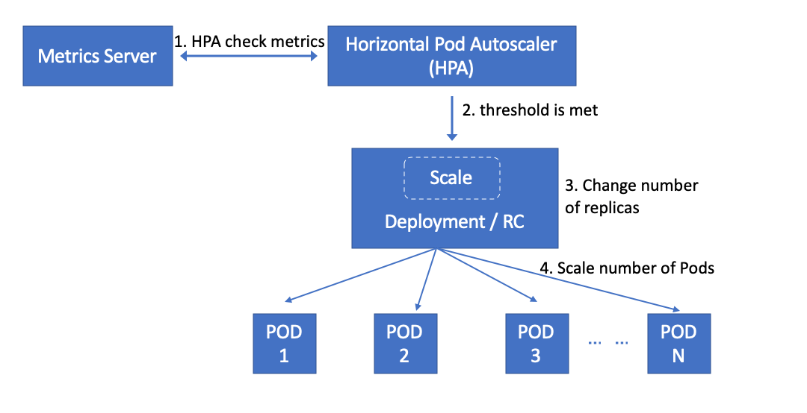

# OKE Pod自动弹性收缩-Horizontal Pod Autoscaling
    
OKE Horizontal Pod Autoscaler是OKE集群中Pod的工作负载资源（如Deployment或StatefulSet）管理器，可自动调整应用 Pod CPU资源和内存组件，实现水平扩展，或水平缩容，保证应用获取资源保证前提下，帮助客户优化成本。
## 1. Pod 自动弹性收缩工作原理


## 2. 确认 Kubernetes Metrics Server

1. 执行下面命令是否安装 Kubernetes Metrics Server

    ```bash
    $<copy> kubectl -n kube-system get deployment/metrics-server </copy>
    NAME             READY   UP-TO-DATE   AVAILABLE   AGE
    metrics-server   1/1     1            1           27d
    ```
2. 如果未安装 Kubernetes Metrics Server

   参见<https://nengbai.github.io/oke-dashboard/?lab=oke-metrics>安装配置 Kubernetes Metrics Server。

## 3. 在OKE集群中部署应用

1. 部署 Apache web 应用

    ```bash
    $<copy> kubectl apply -f https://k8s.io/examples/application/php-apache.yaml </copy>
    deployment.apps/php-apache created
    service/php-apache created
    ```
Apache web server pod manifest文件说明:</br>
    *500m CPU limit: 限制CPU使用最大使用到 500 millicores, 或 1/2 core.</br>
    *200m CPU request：容器启动希望获取 CPU资源在 200 millicores, 或 1/5 core.

## 4. 启动 Horizontal Pod Autoscaler Resource

1. 设置Horizontal Pod Autoscaler 资源最小Pod数量是1，最大使用10副本, 平均CPU使用率50%

    ```bash
    $<copy> kubectl autoscale deployment php-apache --cpu-percent=50 --min=1 --max=10 </copy>
    horizontalpodautoscaler.autoscaling/php-apache autoscaled
    ```

    功能说明:</br>
    *维持最小Pod数量 1,最大副本数 10.</br>
    *增加或减少Pod数量维持每个Pod的CPU使用率在 50% .

2. 等待1分钟左右，确认Horizontal Pod Autoscaler，TARGETS：0%/50% 

    ```bash
    $<copy> kubectl get hpa </copy>
    NAME       REFERENCE             TARGETS MINPODS MAXPODS REPLICAS AGE
    php-apache Deployment/php-apache 0%/50%  1       10      1        10s
    ```

## 5. 增加 Apache web 应用工作负载

1. 启动一个busybox容器，为Apache web 应用增加工作负载

    ```bash
    $<copy> kubectl run -it --rm load-generator --image=busybox /bin/sh --generator=run-pod/v1 </copy>
    NAME       REFERENCE             TARGETS  MINPODS MAXPODS REPLICAS AGE
    php-apache Deployment/php-apache 250%/50% 1       10      1        1m
    ```

2. 等待几分钟, 检查Apache web 应用的中REPLICAS数量

    ```bash
   $<copy> kubectl get hpa </copy>
   NAME       REFERENCE             TARGETS  MINPODS MAXPODS REPLICAS AGE
   php-apache Deployment/php-apache 50%/50%  1       10      5        5m
   ```

3. 确认Apache web 应用的deployment scaled out

    ```bash
    $<copy> kubectl get deployment php-apache </copy>
    NAME       READY UP-TO-DATE AVAILABLE AGE
    php-apache 5/5   5          5         5m
    ```

## 6. 停止Apache web 应用负载加载

1. 终止busybox容器，停止Apache web 应用负载加载

  a. 终止busybox容器

     ```bash
      $<copy> exit </copy>
      Session ended, resume using 'kubectl attach load-generator -c load-generator -i -t' command when the pod is running pod "load-generator" deleted
     ```

  b. 关闭终端工具

2. 确认Horizontal Pod Autoscaler的REPLICAS

    ```bash
    $<copy> kubectl get hpa </copy>
    NAME       REFERENCE             TARGETS MINPODS MAXPODS REPLICAS AGE
    php-apache Deployment/php-apache 0%/50%  1       10      5        10m
    ```

3. 等待几分钟左右, 确认Horizontal Pod Autoscaler的REPLICAS减少

    ```bash
    $<copy> kubectl get hpa </copy>
    NAME       REFERENCE             TARGETS  MINPODS MAXPODS REPLICAS AGE
    php-apache Deployment/php-apache 0%/50%   1       10      1        15m 
    ```

4. 确认Apache web 应用的deployment scaled in
  
    ```bash
    $<copy> kubectl get deployment php-apache </copy>
    NAME       READY UP-TO-DATE AVAILABLE AGE
    php-apache 1/1   1          1         15m
    ```

## 7. 环境清理

1. 删除 Horizontal Pod Autoscaler

    ```bash
    $<copy> kubectl delete horizontalpodautoscaler.autoscaling/php-apache  </copy>
    ```

2. 删除Apache web server deployment

    ```bash
    $<copy> kubectl delete deployment.apps/php-apache service/php-apache  </copy>
    ```
