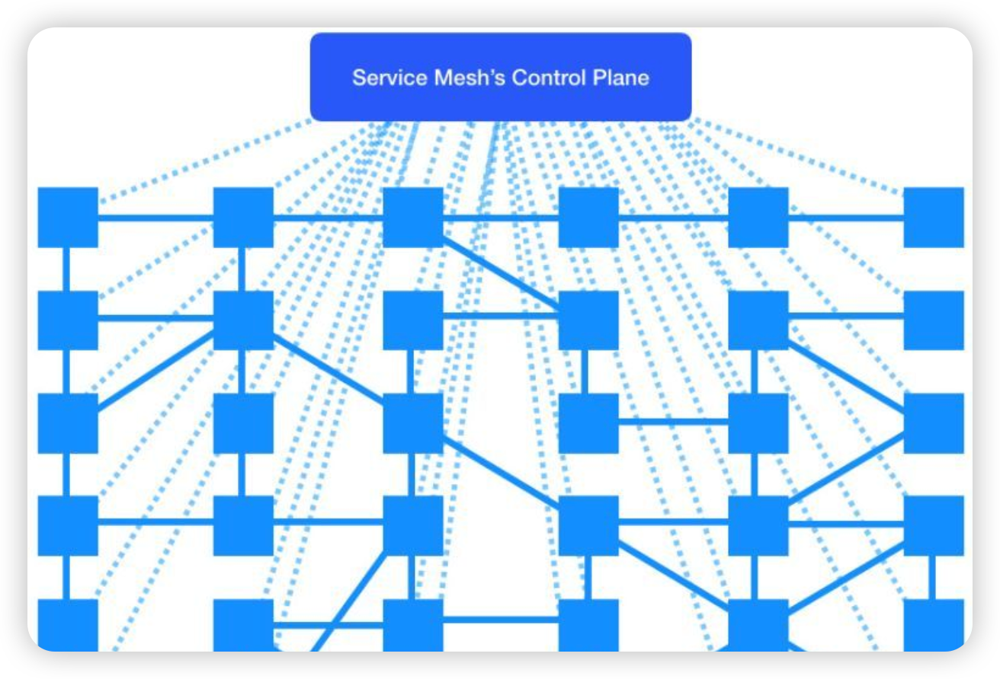

# Istio Service Mesh on OKE

本章节介绍如何在 OKE 上安装Istio，并演示如何在OKE平台无侵入式在应用中植入 Istio 功能。

## 为什么需要 Service Mesh(服务网络)

微服务架构给我们带来方便，同时让系统变得越来越复杂，成千上万个微服务，微服务之间形成网状结构，在微服务治理，微服务监控和微服务故障排查，以及容错带来了很大挑战。这就需要一个有效管理工具：可满足微服务治理，微服务监控和微服务故障排查，以及容错，降低了微服务的复杂性的服务管理工具，称为Service Mesh(服务网络)


## 什么是 Istio Service Mesh？

Istio 是一个开源的Service Mesh（服务网格），可为分布式微服务架构提供所需的基础运行和管理要素。随着越来越多的组织采用云平台，开发者必须使用微服务设计架构以实现可移植性，而运维人员必须管理包含混合云部署和多云部署的大型分布式应用。Istio 采用一种一致的方式来保护、连接和监控微服务，降低了管理微服务部署的复杂性。

从架构设计上来看，Istio 服务网格在逻辑上分为控制平面和数据平面两部分。其中，控制平面（Control Plan）负责管理和配置代理来路由流量，并配置 Mixer 以实施策略和收集遥测数据；数据平面(Data Plan）由一组以 Sidecar 方式部署的智能代理（Envoy）组成，这些代理可以调节和控制微服务及 Mixer 之间所有的网络通信。


## Istio 解决什么问题？

1. 故障排查：接入 Istio 的观察性功能，包括 Logging、Tracing、Metrics 数据。

2. 应用容错：为应用配置 Time Out 超时参数、自动重试、熔断和降级等功能，增加服务的容错性。

3. 无感知应用升级：和 Ingress、Helm、应用上架等相关组件和流程对接，使用 Istio 接管应用的升级发布流程。支持滚动发布，蓝绿发布，灰度发布/金丝雀发布

4. 系统安全：配置应用的 TLS 互信，添加 RBAC 授权，设置应用的流量限制，提升整个集群的安全性。

## 安装 Istio on OKE

1. 下载 Istio 命令行操作工具

    ```bash
    $ <copy> curl -L https://istio.io/downloadIstio | sh - </copy>
    ```
2. 安装 Istioctl 命令行操作工具, 例如下载包为：istio-1.16.1

    ```bash
    $ <copy> cd istio-1.16.1/bin &&
    ./istioctl x precheck </copy>
    ✔ No issues found when checking the cluster. Istio is safe to install or upgrade!
    To get started, check out https://istio.io/latest/docs/setup/getting-started/
    ```
3. 安装 Istio

    ```bash
    $ <copy> istioctl install </copy>
    ```

## 无侵入式为应用植入 Istio功能   


上图是Bookinfo 微服务应用架构图，其功能组件包括：

- Product Page Service: Calls the Details and Reviews services to create a product page.

- Details Service: Returns book information.

- Reviews Service: Returns book reviews and calls the Ratings service.

- Ratings Service: Returns ranking information for a book review.

下面演示 Bookinfo application 无侵入式Istio 功能：
1. 在Namespace 中启动 istio-injection 标识
    ```bash
    $ <copy> kubectl label namespace default istio-injection=enabled </copy>
    ```
2. 部署 Bookinfo application
    ```bash
     $ <copy> kubectl apply -f https://raw.githubusercontent.com/istio/istio/release-1.16/samples/bookinfo/platform/kube/bookinfo.yaml </copy>
    ```
3. 检查该 Namespace 所有 services 和 pods 
    ```bash
     $ <copy> kubectl get services
        kubectl get pods
    </copy>
    ```

4. 验证 微服务应用使用 gateway：INGRESS_HOST 和 INGRESS_PORT
    ```bash
     $ <copy> kubectl exec "$(kubectl get pod -l app=ratings -o jsonpath='{.items[0].metadata.name}')" -c ratings -- curl -sS productpage:9080/productpage | grep -o "<title>.*</title>" </copy>
    ```
5. 增加 book application 访问集群外网功能
    ```bash
     $ <copy> kubectl apply -f https://raw.githubusercontent.com/istio/istio/release-1.16/samples/bookinfo/networking/bookinfo-gateway.yaml </copy>
    ```
6. 集群外验证微服务应用使用 gateway：INGRESS_HOST 和 INGRESS_PORT
    ```bash
     $ <copy> curl -s "http://${INGRESS_HOST}:${INGRESS_PORT}/productpage" | grep -o "<title>.*</title>" </copy>
    ```

## Istio 与其他开源组件集成

1. Istio 与 Prometheus 集成
    ```bash
    $ <copy> kubectl apply -f https://raw.githubusercontent.com/istio/istio/release-1.16/samples/addons/prometheus.yaml </copy>
    ```
2. Istio 与 Grafana 集成
    ```bash
    $ <copy>kubectl apply -f https://raw.githubusercontent.com/istio/istio/release-1.16/samples/addons/grafana.yaml </copy>
    ```
3. Istio 与 Jaeger 集成
    ```bash
    $ <copy>kubectl apply -f https://raw.githubusercontent.com/istio/istio/release-1.16/samples/addons/jaeger.yaml </copy>
    ```
4. Istio 与 Zipkin 集成
    ```bash
    $ <copy>kubectl apply -f https://raw.githubusercontent.com/istio/istio/release-1.16/samples/addons/extras/zipkin.yaml </copy>
    ```
5. Istio 与 Kiali  集成
    ```bash
    $ <copy>kubectl apply -f https://raw.githubusercontent.com/istio/istio/release-1.16/samples/addons/kiali.yaml </copy>
    ```
## Istio 与OCI Observability服务集成
