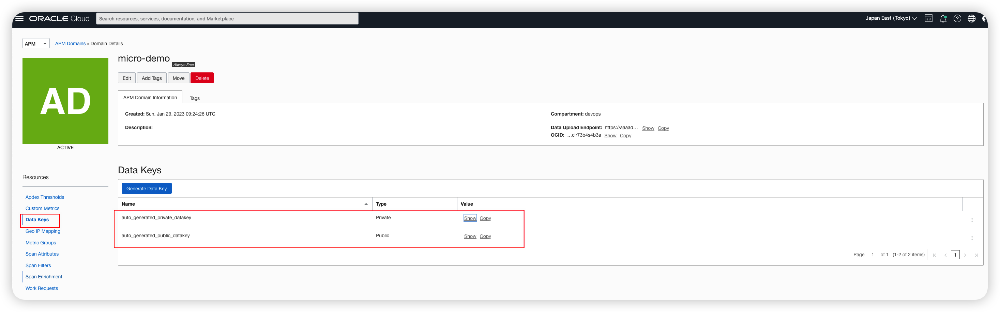

# Istio Service Mesh on OKE

本章节介绍如何在 OKE 上安装Istio，并演示如何在OKE平台无侵入式在应用中植入 Istio 功能。

## 为什么需要 Service Mesh(服务网络)

微服务架构给我们带来方便，同时让系统变得越来越复杂，成千上万个微服务，微服务之间形成网状结构，在微服务治理，微服务监控和微服务故障排查，以及容错带来了很大挑战。这就需要一个有效管理工具：可满足微服务治理，微服务监控和微服务故障排查，以及容错，降低了微服务的复杂性的服务管理工具，称为Service Mesh(服务网络)


## 什么是 Istio Service Mesh？

Istio 是一个开源的Service Mesh（服务网格），可为分布式微服务架构提供所需的基础运行和管理要素。随着越来越多的组织采用云平台，开发者必须使用微服务设计架构以实现可移植性，而运维人员必须管理包含混合云部署和多云部署的大型分布式应用。Istio 采用一种一致的方式来保护、连接和监控微服务，降低了管理微服务部署的复杂性。

从架构设计上来看，Istio 服务网格在逻辑上分为控制平面和数据平面两部分。其中，控制平面（Control Plan）负责管理和配置代理来路由流量，并配置 Mixer 以实施策略和收集遥测数据；数据平面(Data Plan）由一组以 Sidecar 方式部署的智能代理（Envoy）组成，这些代理可以调节和控制微服务及 Mixer 之间所有的网络通信。


## Istio 解决什么问题？

1. 故障排查：接入 Istio 的观察性功能，包括 Logging、Tracing、Metrics 数据。

2. 应用容错：为应用配置 Time Out 超时参数、自动重试、熔断和降级等功能，增加服务的容错性。

3. 无感知应用升级：和 Ingress、Helm、应用上架等相关组件和流程对接，使用 Istio 接管应用的升级发布流程。支持滚动发布，蓝绿发布，灰度发布/金丝雀发布

4. 系统安全：配置应用的 TLS 互信，添加 RBAC 授权，设置应用的流量限制，提升整个集群的安全性。

## 安装 Istio on OKE

1. 下载 Istio 命令行操作工具

    ```bash
    $ <copy> curl -L https://istio.io/downloadIstio | sh - </copy>
    ```
2. 安装 Istioctl 命令行操作工具, 例如下载包为：istio-1.16.1

    ```bash
    $ <copy> cd istio-1.16.1/bin;sudo cp istioctl /usr/bin/;istioctl x precheck </copy>
    ✔ No issues found when checking the cluster. Istio is safe to install or upgrade!
    To get started, check out https://istio.io/latest/docs/setup/getting-started/
    ```
3. 安装 Istio

    ```bash
    $ <copy> istioctl install --set profile=demo -y </copy>
    ✔ Istio core installed                                                                                                              ✔ Istiod installed                                                                                                              ✔ Egress gateways installed                                                                                                              ✔ Ingress gateways installed                                                                                                              ✔ Installation complete                                                                                                               validation.
    ```

## 无侵入式为应用植入 Istio功能   


上图是Bookinfo 微服务应用架构图，其功能组件包括：

- Product Page Service: Calls the Details and Reviews services to create a product page.

- Details Service: Returns book information.

- Reviews Service: Returns book reviews and calls the Ratings service.

- Ratings Service: Returns ranking information for a book review.

下面演示 Bookinfo application 无侵入式Istio 功能：
1. 在Namespace default 中启动 istio-injection 标识
    ```bash
    $ <copy> kubectl label namespace default istio-injection=enabled </copy>
    ```
2. 部署 Bookinfo application
    ```bash
     $ <copy> kubectl apply -f https://raw.githubusercontent.com/istio/istio/release-1.16/samples/bookinfo/platform/kube/bookinfo.yaml </copy>
     service/details created
     service/details created
     serviceaccount/bookinfo-details created
     deployment.apps/details-v1 created
     service/ratings created
     serviceaccount/bookinfo-ratings created
     deployment.apps/ratings-v1 created
     service/reviews created
     serviceaccount/bookinfo-reviews created
     deployment.apps/reviews-v1 created
     deployment.apps/reviews-v2 created
     deployment.apps/reviews-v3 created
     service/productpage created
     serviceaccount/bookinfo-productpage created
     deployment.apps/productpage-v1 created
    ```
3. 检查该 Namespace 所有 services 和 pods 
    ```bash
     $ <copy> kubectl get services
        kubectl get pods
       </copy>
      NAME                                              TYPE        CLUSTER-IP      EXTERNAL-IP   PORT(S)             AGE
      details                                           ClusterIP   10.96.72.97     <none>        9080/TCP            100s
      productpage                                       ClusterIP   10.96.162.188   <none>        9080/TCP            100s
      ratings                                           ClusterIP   10.96.54.128    <none>        9080/TCP            100s
      reviews                                           ClusterIP   10.96.40.17     <none>        9080/TCP            100s
    ```

4. 验证 微服务应用使用 ingress IP and port：INGRESS_HOST 和 INGRESS_PORT
    ```bash
     $ <copy> kubectl exec "$(kubectl get pod -l app=ratings -o jsonpath='{.items[0].metadata.name}')" -c ratings -- curl -sS productpage:9080/productpage | grep -o "<title>.*</title>" </copy>
     <title>Simple Bookstore App</title>
    ```
5. 增加 book application 访问集群外网功能
    ```bash
     $ <copy> kubectl apply -f https://raw.githubusercontent.com/istio/istio/release-1.16/samples/bookinfo/networking/bookinfo-gateway.yaml </copy>
     gateway.networking.istio.io/bookinfo-gateway created
     virtualservice.networking.istio.io/bookinfo created
    ```
6. 获取 INGRESS_HOST 和 INGRESS_PORT
    ```bash
    $ <copy> export INGRESS_HOST=`kubectl -n istio-system get svc|grep istio-ingressgateway|awk '{print $3}'` </copy>
    ```

7. 集群外验证微服务应用使用 gateway：INGRESS_HOST 和 INGRESS_PORT

    ```bash
     $ <copy> curl -s "http://${INGRESS_HOST}/productpage" | grep -o "<title>.*</title>" </copy>
     <title>Simple Bookstore App</title>
    ```

## Istio 与其他开源组件集成

1. Istio 与 Prometheus 集成
    ```bash
    $ <copy> kubectl apply -f https://raw.githubusercontent.com/istio/istio/release-1.16/samples/addons/prometheus.yaml </copy>
    serviceaccount/prometheus created
    configmap/prometheus created
    clusterrole.rbac.authorization.k8s.io/prometheus created
    clusterrolebinding.rbac.authorization.k8s.io/prometheus created
    service/prometheus created
    deployment.apps/prometheus created
    ```
2. Istio 与 Grafana 集成
    ```bash
    $ <copy>kubectl apply -f https://raw.githubusercontent.com/istio/istio/release-1.16/samples/addons/grafana.yaml </copy>
    serviceaccount/grafana created
    configmap/grafana created
    service/grafana created
    deployment.apps/grafana created
    configmap/istio-grafana-dashboards created
    configmap/istio-services-grafana-dashboards created
    ```
3. Istio 与 Jaeger 集成
    ```bash
    $ <copy>kubectl apply -f https://raw.githubusercontent.com/istio/istio/release-1.16/samples/addons/jaeger.yaml </copy>

    ```
4. Istio 与 Zipkin 集成
    ```bash
    $ <copy>kubectl apply -f https://raw.githubusercontent.com/istio/istio/release-1.16/samples/addons/extras/zipkin.yaml </copy>
    deployment.apps/jaeger created
    service/tracing created
    service/zipkin created
    service/jaeger-collector created
    ```
5. Istio 与 Kiali  集成
    ```bash
    $ <copy> kubectl apply -f https://raw.githubusercontent.com/istio/istio/release-1.16/samples/addons/kiali.yaml </copy>
    serviceaccount/kiali created
    configmap/kiali created
    clusterrole.rbac.authorization.k8s.io/kiali-viewer created
    clusterrole.rbac.authorization.k8s.io/kiali created
    clusterrolebinding.rbac.authorization.k8s.io/kiali created
    role.rbac.authorization.k8s.io/kiali-controlplane created
    rolebinding.rbac.authorization.k8s.io/kiali-controlplane created
    service/kiali created
    deployment.apps/kiali created
    ```
## Istio Dashbaord 可视化展现

### Prometheus 展示 Bookinfo application 性能指标Metrics 

1. 确认Prometheus 是否安装
    ```bash
     $ <copy> kubectl -n istio-system get svc prometheus </copy>
    ```
2. 启动 Prometheus UI 
    ```bash
    $ <copy> istioctl dashboard prometheus </copy>
    ```
3. 执行Prometheus 查询
   在 “Expression” 中输入下面： 
    ```bash
     $ <copy> istio_requests_total </copy>
    ```
    

### 管理 Grafana Dashboards

1. 确认 Prometheus 和 Grafana 已经安装
    ```bash
    $ <copy> kubectl -n istio-system get svc prometheus；kubectl -n istio-system get svc grafana </copy>

    ```
2. 启动 Istio Grafana dashboard
    ```bash
    $ <copy> istioctl dashboard grafana </copy>
    ```
3. Grafana Dashboard展示

    

    更多Dashboard 展示参照下图所示：
    

### Jaeger 分布式跟踪

1. 使用 istioctl 启用 tracing 功能
    ```bash
    $ <copy> istioctl install --set meshConfig.enableTracing=true </copy>
    This will install the Istio 1.16.1 default profile with ["Istio core" "Istiod" "Ingress gateways"] components into the cluster. Proceed? (y/N) y
    ✔ Istio core installed                                                                                                              ✔ Istiod installed                                                                                                              ✔ Ingress gateways installed                                                                                                              ✔ Installation complete                                                                                                               Thank you for installing Istio 1.16.  Please take a few minutes to tell us about your install/upgrade experience!  https://forms.gle/99uiMML96AmsXY5d6
    ```
2. 启用 Jaeger UI 
    ```bash
    $ <copy> istioctl dashboard jaeger </copy>
    ```
3. 获取 INGRESS_HOST 和 INGRESS_PORT
    ```bash
    $ <copy> export INGRESS_HOST=`kubectl -n istio-system get svc|grep istio-ingressgateway|awk '{print $4}'` </copy>
    ```

4. 发送requests 到 product 页面，使用 Jaeger 跟踪分析
    ```bash
    $ <copy> for i in $(seq 1 100); do curl -s -o /dev/null "http://$INGRESS_HOST/productpage"; done </copy>
    ```

### Zipkin 分布式跟踪

1. 激活 Zipkin 功能
    ```bash
    $ <copy> istioctl install --set meshConfig.enableTracing=true </copy>
    This will install the Istio 1.16.1 default profile with ["Istio core" "Istiod" "Ingress gateways"] components into the cluster. Proceed? (y/N) y
    ✔ Istio core installed                                                                                                              ✔ Istiod installed                                                                                                              ✔ Ingress gateways installed                                                                                                              ✔ Installation complete                                                                                                               Making this installation the default for injection and validation.
    Thank you for installing Istio 1.16.  Please take a few minutes to tell us about your install/upgrade experience!  https://forms.gle/99uiMML96AmsXY5d6
    ```
2. 启用 Zipkin Dashboard
    ```bash
    $ <copy> istioctl dashboard zipkin </copy>
    ```
3. 获取 INGRESS_HOST 和 INGRESS_PORT
    ```bash
    $ <copy> export INGRESS_HOST=`kubectl -n istio-system get svc|grep istio-ingressgateway|awk '{print $4}'` </copy>
    ```

4. 发送requests 到 product 页面，使用 Zipkin 跟踪分析
    ```bash
    $ <copy> for i in $(seq 1 100); do curl -s -o /dev/null "http://$INGRESS_HOST/productpage"; done </copy>
    ```
## Istio 与OCI APM 服务集成
### 准备与OCI APM 服务

1. 开通OCI APM 权限

    - <a href="https://docs.oracle.com/iaas/Content/Identity/Reference/apmpolicyreference.htm">APM Policy Reference</a>
    - <a href="https://docs-uat.us.oracle.com/en/cloud/paas/application-performance-monitoring/apmgn/perform-oracle-cloud-infrastructure-prerequisite-tasks.html">APM Policy Example</a> 

2. 新建 OCI APM Domain

    

3. 获取 OCI APM endpoint
    

4. 获取 OCI APM 访问密钥
    
### Istio 与OCI APM 服务集成
1. 激活 到OCI APM tracing 跟踪功能
    ```bash
    $ <copy> istioctl install --set meshConfig.defaultConfig.tracing.zipkin.address=istioctl install --set meshConfig.defaultConfig.tracing.zipkin.address=aaaadbp426m2aaaaaaaaaabpwa.apm-agt.ap-tokyo-1.oci.oraclecloud.com:443 </copy>
    Error: accepts 0 arg(s), received 1
    ```
2. 下载配置文件 custom-bootstrap.yaml

    ```bash
    $ <copy> curl -o custom-bootstrap.yaml https://raw.githubusercontent.com/nengbai/oke-dashboard/main/oke-istio/custom-bootstrap.yaml </copy>
    ```
    参照下面说明调整相关内容：
    ```txt
    apiVersion: v1
    kind: ConfigMap
    metadata:
    name: istio-custom-bootstrap-config
    namespace: default
    data:
    custom_bootstrap.json: |
        {
            "tracing": {
                "http": {
                    "name": "envoy.tracers.zipkin",
                    "typed_config": {
                        "@type": "type.googleapis.com/envoy.config.trace.v3.ZipkinConfig",
                        "collector_cluster": "aaaadbp426m2aaaaaaaaaabpwa.apm-agt.ap-tokyo-1.oci.oraclecloud.com", // [Replace this with data upload endpoint of your apm domain]
                        "collector_endpoint": "/20200101/observations/private-span?dataFormat=zipkin&dataFormatVersion=2&dataKey=Z5CV4WELEOSGVM5XH5VOBOZ6QEFQUESU", // [Replace with the private datakey of your apm domain. You can also use public datakey but change the observation type to public-span]
                        "collectorEndpointVersion": "HTTP_JSON",
                        "trace_id_128bit": true,
                        "shared_span_context": false
                    }
                }
            },
            "static_resources": {
                "clusters": [{
                    "name": "aaaabbbb.apm-agt.us-ashburn-1.oci.oraclecloud.com", // [Replace this with data upload endpoint of your apm domain:443]
                    "type": "STRICT_DNS",
                    "lb_policy": "ROUND_ROBIN",
                    "load_assignment": {
                        "cluster_name": "aaaadbp426m2aaaaaaaaaabpwa.apm-agt.ap-tokyo-1.oci.oraclecloud.com", // [Replace this with data upload endpoint of your apm domain]
                        "endpoints": [{
                            "lb_endpoints": [{
                                "endpoint": {
                                    "address": {
                                        "socket_address": {
                                            "address": "aaaadbp426m2aaaaaaaaaabpwa.apm-agt.ap-tokyo-1.oci.oraclecloud.com", // [Replace this with data upload endpoint of your apm domain]
                                            "port_value": 443
                                        }
                                    }
                                }
                            }]
                        }]
                    },
                    "transport_socket": {
                        "name": "envoy.transport_sockets.tls",
                        "typed_config": {
                            "@type": "type.googleapis.com/envoy.extensions.transport_sockets.tls.v3.UpstreamTlsContext",
                            "sni": "aaaadbp426m2aaaaaaaaaabpwa.apm-agt.ap-tokyo-1.oci.oraclecloud.com" // [Replace this with data upload endpoint of your apm domain]
                        }
                    }
                }]
            }
        }
    ```
3. 执行custom-bootstrap.yaml， 配置从Envoy  发送 zipkin traces 到OCI APM

    ```bash
     $ <copy> kubectl apply -f custom-bootstrap.yaml </copy>
    ```
4. 下载 Bookinfo 应用 bookinfo.yaml
    ```bash
     $ <copy> curl -o bookinfo.yaml https://raw.githubusercontent.com/nengbai/oke-dashboard/main/oke-istio/bookinfo.yaml </copy>
    ```
    参照下面说明调整相关内容：
    ```text
    apiVersion: apps/v1
    kind: Deployment
    metadata:
    name: productpage-v1
    labels:
        app: productpage
        version: v1
    spec:
    replicas: 1
    selector:
        matchLabels:
        app: productpage
        version: v1
    template:
        metadata:
        labels:
            app: productpage
            version: v1
        annotations:
            sidecar.istio.io/bootstrapOverride: "istio-custom-bootstrap-config" #[Name of custom configmap]
        spec:
        serviceAccountName: bookinfo-productpage
        containers:
            - name: productpage
            image: docker.io/istio/examples-bookinfo-productpage-v1:1.16.2
            imagePullPolicy: IfNotPresent
            ports:
                - containerPort: 9080
            volumeMounts:
                - name: tmp
                mountPath: /tmp
            securityContext:
                runAsUser: 1000
        volumes:
            - name: tmp
            emptyDir: {}
    ---
    ```
5. 执行bookinfo.yaml,调整Bookinfo 应用的sidecar 为 custom bootstrap
    ```bash
     $ <copy> kubectl apply -f bookinfo.yaml </copy>
    ```

6.  下载 ingress-gateway 配置文件：ingress-custom-bootstrap.yaml
    ```bash
     $ <copy> curl -o ingress-custom-bootstrap.yaml https://raw.githubusercontent.com/nengbai/oke-dashboard/main/oke-istio/ingress-custom-bootstrap.yaml </copy>
    ```
    参照下面说明调整相关内容：

    ```text
    apiVersion: v1
    kind: ConfigMap
    metadata:
    name: istio-custom-bootstrap-config
    namespace: istio-system
    data:
    custom_bootstrap.json: |
        {
            "tracing": {
                "http": {
                    "name": "envoy.tracers.zipkin",
                    "typed_config": {
                        "@type": "type.googleapis.com/envoy.config.trace.v3.ZipkinConfig",
                        "collector_cluster": "aaaabbbb.apm-agt.us-ashburn-1.oci.oraclecloud.com", // [Replace this with data upload endpoint of your apm domain]
                        "collector_endpoint": "/20200101/observations/private-span?dataFormat=zipkin&dataFormatVersion=2&dataKey=2C6YOLQSUZ5Q7IGN", // [Replace with the private datakey of your apm domain. You can also use public datakey but change the observation type to public-span]
                        "collectorEndpointVersion": "HTTP_JSON",
                        "trace_id_128bit": true,
                        "shared_span_context": false
                    }
                }
            },
            "static_resources": {
                "clusters": [{
                    "name": "aaaabbbb.apm-agt.us-ashburn-1.oci.oraclecloud.com", // [Replace this with data upload endpoint of your apm domain:443]
                    "type": "STRICT_DNS",
                    "lb_policy": "ROUND_ROBIN",
                    "load_assignment": {
                        "cluster_name": "aaaabbbb.apm-agt.us-ashburn-1.oci.oraclecloud.com", // [Replace this with data upload endpoint of your apm domain]
                        "endpoints": [{
                            "lb_endpoints": [{
                                "endpoint": {
                                    "address": {
                                        "socket_address": {
                                            "address": "aaaabbbb.apm-agt.us-ashburn-1.oci.oraclecloud.com", // [Replace this with data upload endpoint of your apm domain]
                                            "port_value": 443
                                        }
                                    }
                                }
                            }]
                        }]
                    },
                    "transport_socket": {
                        "name": "envoy.transport_sockets.tls",
                        "typed_config": {
                            "@type": "type.googleapis.com/envoy.extensions.transport_sockets.tls.v3.UpstreamTlsContext",
                            "sni": "aaaabbbb.apm-agt.us-ashburn-1.oci.oraclecloud.com" // [Replace this with data upload endpoint of your apm domain]
                        }
                    }
                }]
            }
        }
    ```

7. 执行ingress-custom-bootstrap.yaml， 启用ingress-gateway 发送 traces, 
    ```bash
     $ <copy> kubectl apply -f ingress-custom-bootstrap.yaml </copy>
    ```

 
8. 下载 gateway-patch.yaml
     ```bash
     $ <copy> curl -o ingress-custom-bootstrap.yaml https://raw.githubusercontent.com/nengbai/oke-dashboard/main/oke-istio/gateway-patch.yaml </copy>
    ```
    参照下面说明调整相关内容：

    ```text
    spec:
    template:
        spec:
        containers:
        - name: istio-proxy
            env:
            - name: ISTIO_BOOTSTRAP_OVERRIDE
            value: /etc/istio/custom-bootstrap/custom_bootstrap.json
            volumeMounts:
            - mountPath: /etc/istio/custom-bootstrap
            name: custom-bootstrap-volume
            readOnly: true
        volumes:
        - configMap:
            name: istio-custom-bootstrap-config
            defaultMode: 420
            optional: false
            name: custom-bootstrap-volume
    ```

9. Patch ingress gateway
    ```bash
     $ <copy> kubectl --namespace istio-system patch deployment istio-ingressgateway --patch "$(cat gateway-patch.yaml)" </copy>
    ```
10.  获取 INGRESS_HOST 和 INGRESS_PORT
    ```bash
    $ <copy> export INGRESS_HOST=`kubectl -n istio-system get svc|grep istio-ingressgateway|awk '{print $4}'` </copy>
    ```

11. 发送requests 到 product 页面，使用 Zipkin 跟踪分析
    ```bash
    $ <copy> for i in $(seq 1 100); do curl -s -o /dev/null "http://$INGRESS_HOST/productpage"; done </copy>
    ```